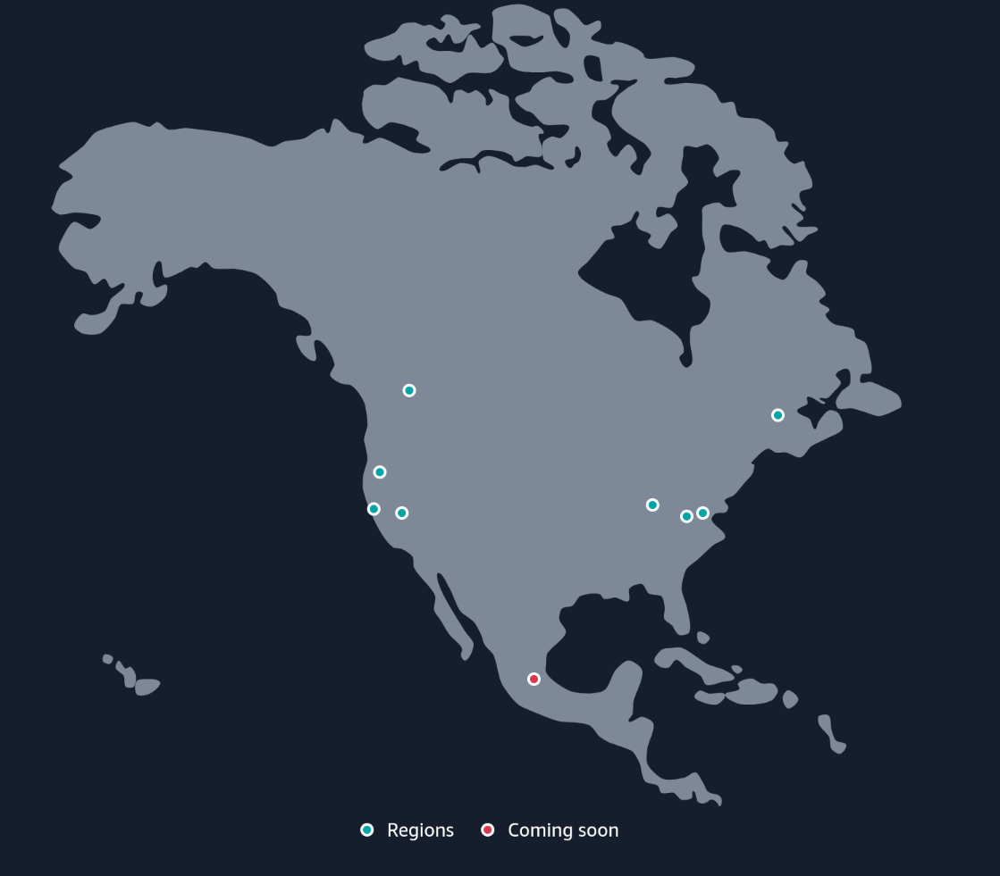
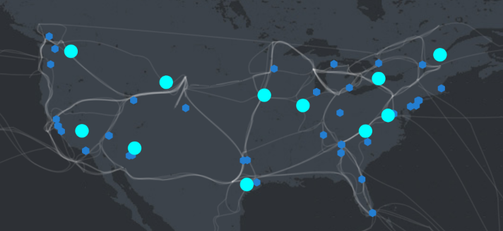

# Github Actions Metrics
Information on Github hosted runners like the Azure region they run on is
necessary info when optimising CD/CI pipelines(especially network latencies and
route path bandwidth). Github does not disclose it so I did it myself.

Using this info, place the resources(DB, object storage, other instances) near
the runners are usually run.

A few pieces of info I could gather online:

- Azure doesn't provide a list of VM service endpoints like AWS
- Github-hosted Actions runners are actually Azure VMs (surprisingly, not in a
  container)
- Github is hosted in the data centre somewhere in the US, probably in the same
  data centre where Azure is present

Microsoft definitely has more points of presence than any other cloud service
providers, but there's no official list of data center endpoints to ping. If you
look at the map,

they're close enough. For most devs, all that matters is probably how close
their S3 buckets are to the Github Actions runners. Some AWS and Azure regions
are under the same roof, but then again, no official data.

## DATA
Updated: 2026-10-03T15:01:07.053278+00:00

| AWS Region | Avg Latency | Least |
| - | - | - |
| af-south-1 | 1.006 |  |
| ap-east-1 | 0.664 |  |
| ap-east-2 | 0.603 |  |
| ap-northeast-1 | 0.484 |  |
| ap-northeast-2 | 0.577 |  |
| ap-northeast-3 | 0.510 |  |
| ap-south-1 | 0.869 |  |
| ap-south-2 | 0.907 |  |
| ap-southeast-1 | 0.764 |  |
| ap-southeast-2 | 0.664 |  |
| ap-southeast-3 | 0.795 |  |
| ap-southeast-4 | 0.706 |  |
| ap-southeast-5 | 0.759 |  |
| ap-southeast-6 | 0.702 |  |
| ap-southeast-7 | 0.850 |  |
| ca-central-1 | 0.224 | 18 |
| ca-west-1 | 0.201 |  |
| eu-central-1 | 0.518 |  |
| eu-central-2 | 0.529 |  |
| eu-north-1 | 0.569 |  |
| eu-south-1 | 0.537 |  |
| eu-south-2 | 0.539 |  |
| eu-west-1 | 0.440 |  |
| eu-west-2 | 0.474 |  |
| eu-west-3 | 0.495 |  |
| il-central-1 | 0.684 |  |
| me-central-1 | 0.916 |  |
| me-south-1 | 0.791 |  |
| mx-central-1 | 0.248 |  |
| sa-east-1 | 0.648 |  |
| us-east-1 | 0.186 | 5134 |
| us-east-2 | 0.173 | 1690 |
| us-gov-east-1 | 0.199 | 1932 |
| us-gov-west-1 | 0.156 | 237 |
| us-west-1 | 0.150 | 4153 |
| us-west-2 | 0.156 | 192 |

